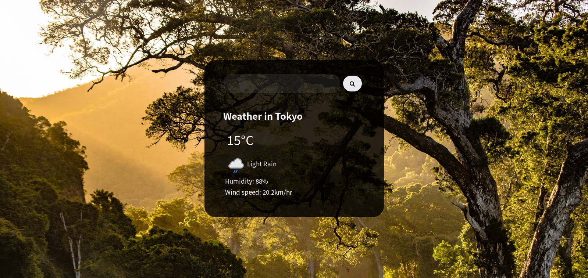
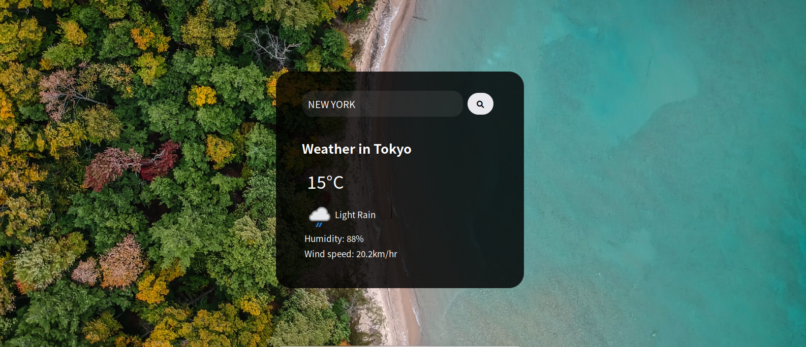

#   A  Weather App 

## Overview
 
A  weather app that uses an API which displays the windspeed, humidity, degrees in celsius.

### The challenge

The challenge was to make a weather app that primarilay depended on an API  to fetch  weather  information about in any location in the world. All you had to do is type in the name of the city in  the input and submit it and it will be displayed.

### Screenshot
BEFORE

AFTER



### Links


- Live Site URL: [ https://amani-dot.github.io/Weather-App/](https://your-live-site-url.com)

## My process

### Built with

- Semantic HTML5 markup
- CSS custom properties
- Flexbox
- CSS Grid
- Mobile-first workflow


### What I learned

I learned a lot about how API's work and how invaluable, time-saving they are, how to get data from them and implement in any project I'm doing.

To see how you can add code snippets, see below:

```html
<h1>Some HTML code I'm proud of</h1>
```
```css
.proud-of-this-css {
  color: papayawhip;
  .loading{
    visibility:hidden;
    max-height: 20px;
    position: relative;
}

.weather.loading:after{
     visibility: visible;
     content: "Loading....";
     color:white ;
     position: absolute;
     top: 0;
     left:20px ;
}
}
```
```js
const proudOfThisFunc = () => {
  console.log('🎉')
  displayWeather: function(data){
       const { name } = data.location;
       const { icon,  text} = data.current.condition;
       const { humidity} =data.current;
       const {temp_c,wind_kph} = data.current;
       console.log(name, icon, text, temp_c, humidity, wind_kph);

       document.querySelector('.city').innerText = " Weather in " + name;
       document.querySelector('.icon').src =  `${icon}`;
       document.querySelector('.description').innerText = text;
       document.querySelector('.temp').innerText = temp_c + '°C';
       document.querySelector('.humidity').innerText =  "Humidity:  " + humidity  + "%";
       document.querySelector('.wind').innerText = "Wind speed:  " + wind_kph + "km/hr";
       document.querySelector('.weather').classList.remove('loading');
       document.body.style.backgroundImage = url('https:/source.unsplash.com/1600x900/?" + name + "')
    },

}
```


### Continued development

Try to figure out a way to make it faster and make images of the loaction searched be the background image.
## Author

- Website - [Add your name here](https://www.your-site.com)
- Twitter - [@Amani-Off](https://www.twitter.com/yourusername)

